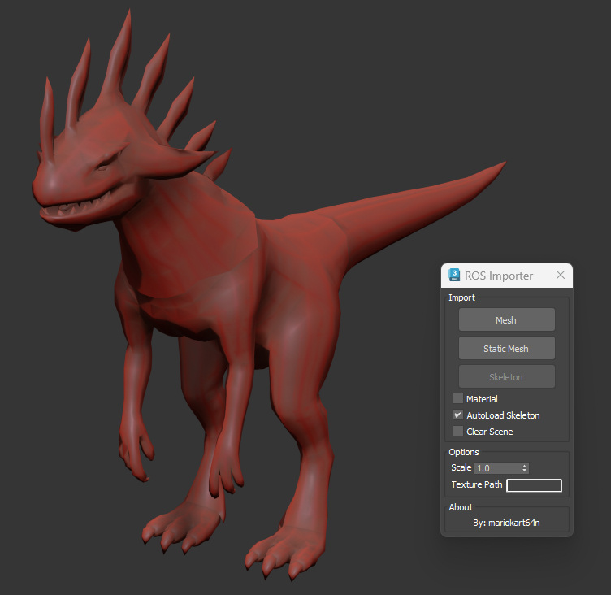

# MSX Dragons Prophet PC

**MSX Dragons Prophet PC** is a MaxScript tool designed to import 3D models from the game *Dragon's Prophet* into 3ds Max. The script supports both static and skinned meshes, allowing users to bring in game assets for further editing and visualization.

## Table of Contents

- [Features](#features)
- [Prerequisites](#prerequisites)
- [Usage](#usage)
  - [Importing Static Meshes](#importing-static-meshes)
  - [Importing Skinned Meshes](#importing-skinned-meshes)
- [Limitations](#limitations)
- [Additional Information](#additional-information)

## Features

- **Static Mesh Import:** Easily import static mesh `.ros` files into 3ds Max.
- **Skinned Mesh Import:** Import skinned meshes along with their skeletons. You can choose to import the skeleton manually or enable automatic import.
- **Bone Import:** Handles the import of bone structures required for skinned meshes.
- **Texture Mapping:** Supports diffuse, normal, and gloss maps in DDS format.
- **Asset Preview:** Includes a preview image showcasing the imported mesh in 3ds Max.

## Prerequisites

- **3ds Max:** Ensure you have 3ds Max installed on your PC.
- **MaxScript Knowledge:** Basic understanding of MaxScript is beneficial but not required.
- **Dragon's Prophet Game Files:** You need access to the game's `.ros` and `.ras` files for importing models and animations.

## Usage

### Importing Static Meshes

1. **Select Import Static Mesh:**
   - In 3ds Max, run the `GetMesh` MaxScript function.
   - Choose the option to import a static mesh `.ros` file.
2. **Load the `.ros` File:**
   - Select the desired `.ros` file corresponding to a static mesh.
3. **View the Imported Mesh:**
   - The mesh will be imported into the scene with applied textures.

### Importing Skinned Meshes

1. **Import Skeleton:**
   - Before importing a skinned mesh, you must import its skeleton.
   - Use the **Import Skeleton** button provided in the MaxScript interface.
   - Alternatively, enable the toggle for automatic skeleton import.
2. **Select Import Skinned Mesh:**
   - Run the `GetMesh` MaxScript function.
   - Choose the option to import a skinned mesh `.ros` file.
3. **Load the `.ros` File:**
   - Select the desired `.ros` file corresponding to a skinned mesh.
4. **Handle Errors:**
   - If the wrong type of `.ros` file is selected, the script will throw an error. Ensure you select the correct file type.

## Limitations

- **Manual Import Selection:** Users must manually select whether to import a static or skinned mesh. Importing the incorrect file type will result in errors.
- **Skeleton Import Dependency:** When importing skinned meshes, the skeleton must be imported first. Failure to do so will prevent the skinned mesh from functioning correctly.
- **Work-In-Progress:** The import capabilities are still under development and may not support all features or handle all file variations from the game.
- **Compatibility Issues:** Some `.ros` files containing animations or additional details may cause the script to crash or consume excessive memory.

## Additional Information

For more detailed technical discussions, troubleshooting, and insights into the file formats used by *Dragon's Prophet*, please refer to the [Wiki](wiki.md).
